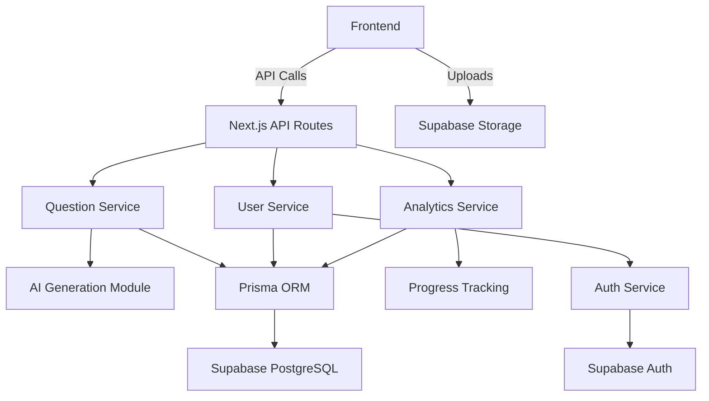

# System Architecture

## Overview
The system follows a layered architecture with clear separation of concerns:
1. **Presentation Layer**: Next.js frontend
2. **Application Layer**: API routes and services
3. **Domain Layer**: Business logic and AI services
4. **Data Layer**: Database and storage

## Component Diagram

## Key Components

### 1. Frontend (Next.js 15+)
- App router for routing
- Tailwind for styling
- Components:
  - Question Interface (voice/text input)
  - Dashboard (progress tracking)
  - Study Modes (Anki-like views)
  - Profile/Reporting

### 2. Backend Services
- **Question Service**: Manages question lifecycle (creation, SRS scheduling)
- **User Service**: Handles authentication and profile management
- **Analytics Service**: Tracks progress and generates insights
- **AI Module**: Generates questions using LLMs, analyzes responses

### 3. Data Layer
- **Prisma Schema**: 
  - User (id, email, progress)
  - Question (id, content, difficulty, category)
  - Response (id, content, correctness, timestamp)
  - SRSData (interval, nextReview)
- **Supabase Integration**: 
  - PostgreSQL for relational data
  - Bucket storage for voice recordings
  - Auth for user management

### 4. AI Integration
- **Question Generation**: Uses LLM to create role-specific questions
- **Response Analysis**: Evaluates voice/text responses
- **Readiness Algorithm**: Calculates interview preparedness

## Data Flow
1. User initiates session → Frontend requests question → Question Service
2. User responds → Response stored → AI analysis → SRS update
3. Dashboard requests data → Analytics Service → Progress visualization